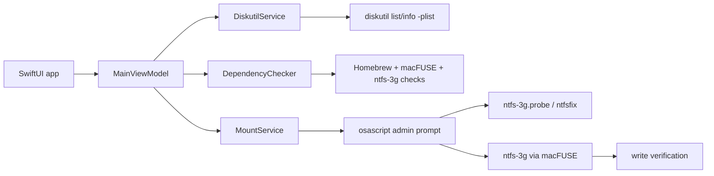

# Architecture

NTFS Writer for Mac keeps the product layer separate from the filesystem engine.

## Components

- `MacNTFSWriter`: SwiftUI desktop app.
- `MacNTFSWriterCore`: Foundation-only core layer for scanning, dependency checks and mount operations.
- `DiskutilService`: reads macOS plist output instead of parsing human-readable command text.
- `DependencyChecker`: checks for Homebrew, macFUSE installation, macFUSE loading state, and `ntfs-3g`.
- `MountService`: creates a mount point under `/Volumes/MacNTFSWriter`, unmounts any read-only macOS mount, runs `ntfs-3g.probe`, mounts through `ntfs-3g`, optionally runs `ntfsfix`, and verifies writable mounts with a real create/delete test.

## Mount Modes

- Read-only mode uses `ntfs-3g` with `ro` and is the safest path for hibernated or suspicious disks.
- Writable mode uses `uid`, `gid`, `umask=000`, and `streams_interface=none`, then verifies writes.
- Forced writable mode first runs `ntfsfix -d`, then mounts with `recover,remove_hiberfile`. It is intentionally behind a confirmation dialog because it may discard Windows hibernation state.

## Production Path

For a public release, replace the AppleScript authorization path with a signed privileged helper installed with `SMAppService`, then notarize the app. That gives cleaner permission handling and avoids embedding privileged shell scripts inside UI flows.
